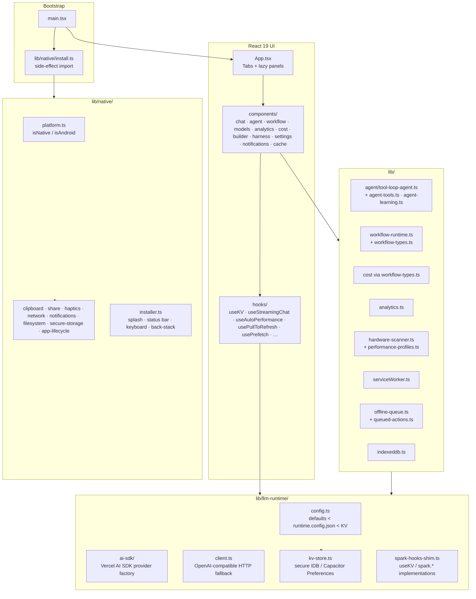

# Architecture Overview

> A 30-second tour of the TrueAI codebase, from `main.tsx` to the Android APK.
>
> *Audience: developer · Last reviewed: 2026-05-02*

This page sets the mental model. Each numbered subsystem has its own
deeper page linked below.

---

## High-level diagram

---

## Bootstrap

`src/main.tsx` is the entry point. It:

1. Side-effect-imports `@/lib/native/install` (idempotent; no-op on web).
2. Mounts the React tree under an `ErrorBoundary` (`ErrorFallback.tsx`).
3. Registers the service worker (`src/lib/serviceWorker.ts`).
4. Bootstraps the pre-mount error capture
   (`src/lib/preMountErrorCapture.ts`) so even crashes before React
   mounts surface a useful message.

---

## App shell

`src/App.tsx` is a tabbed shell. Tab content is **lazily** loaded
via `React.lazy` + `Suspense`, wrapped in `LazyErrorBoundary`. The
active tab is persisted in KV (`active-tab`), guarded by an
`isTabName` validator so renamed/removed tabs fall back cleanly.

The header carries: theme toggle, online indicator, queue badge,
service-worker update banner, and the settings menu.

The mobile build adds: bottom nav, floating action button,
pull-to-refresh, swipe-to-change-tab gestures.

---

## State

Persisted state goes through **`useKV`** (from
`@/lib/llm-runtime/use-kv.ts`, aliased to look like the Spark API).
Under the hood:

- IndexedDB is the primary store (`kv-store.ts` → `indexeddb.ts`).
- Sensitive values use `kvStore.setSecure()` which **never** falls
  back to `localStorage` — see [State & Persistence](State-and-Persistence).
- Large blobs (long conversation histories, etc.) go into a
  dedicated IndexedDB store via `useIndexedDBCache`.

---

## LLM access

All chat / agent / workflow code calls into `src/lib/llm-runtime/`.
Two client paths coexist:

- **AI SDK path** (`ai-sdk/`) — the default. Uses Vercel's AI SDK
  with provider modules (`@ai-sdk/openai`, `@ai-sdk/anthropic`,
  `@ai-sdk/google`, `@ai-sdk/openai-compatible`). Hosted providers
  are **dynamically imported** to keep the initial bundle small.
- **HTTP fallback** (`client.ts`) — calls `POST {baseUrl}/chat/completions`
  directly. Used by the `spark.*` shim for compatibility.

See [LLM Runtime](LLM-Runtime).

---

## Native bridge

`src/lib/native/` hides Capacitor behind a uniform JS API. Every
file follows the same shape: top-level `await import('@capacitor/...')`
inside an `if (isNative()) { … }` branch, with a web fallback in
the `else` branch. Test pattern is `*.android.test.ts` files using
`vi.mock('./platform', …)` — see [Testing](Testing).

---

## Domain modules

| Module | Purpose | Page |
| --- | --- | --- |
| `agent/tool-loop-agent.ts` + `agent-tools.ts` + `agent-learning.ts` | Agent engine | [Agent Engine](Agent-Engine) |
| `workflow-runtime.ts` + `workflow-types.ts` | Workflow engine | [Workflow Engine](Workflow-Engine) |
| `analytics.ts` | Local analytics aggregator | [Analytics](Analytics) |
| `hardware-scanner.ts` + `performance-profiles.ts` | Device capability | [Hardware Optimizer](Hardware-Optimizer) |
| `serviceWorker.ts` + `offline-queue.ts` + `queued-actions.ts` | Offline | [Offline & Sync](Offline-and-Sync) |
| `indexeddb.ts` | Cache store | [State & Persistence](State-and-Persistence) |
| `huggingface.ts` | HF browser client | [Models](Models) |

---

## Build & ship

- **Web**: Vite 8 (`npm run build` for prod, `npm run build:dev` for
  the Capacitor-friendly dev build).
- **Android**: `npx cap sync android` then Gradle. `JAVA_HOME` must
  point at JDK 21.
- **Tests**: Vitest (jsdom + happy-dom). Maestro for Android E2E.
- **Lint**: ESLint v10 + `eslint-plugin-react-hooks` v7 (with five
  noisy new rules demoted to `warn`).

See [Build & Release](Build-and-Release), [Testing](Testing),
[CI Workflows](CI-Workflows).

---

## Conventions worth knowing day one

- **Don't write to `localStorage` for credentials.** Ever. See
  [Privacy](Privacy).
- **Don't weaken `package.json` `overrides` pins** — they patch CVEs.
- **Don't add telemetry / analytics SDKs.** It's local-first by
  charter.
- **Don't edit `.github/**`** unless your task explicitly asks.
- All new state should be persisted through `useKV` (or the explicit
  IndexedDB cache for large blobs), not ad-hoc `window.*`.
- All new native capabilities should land under `src/lib/native/`
  with a web fallback.
- All new components ship with a test (`*.test.tsx`) — see
  [Testing](Testing) for the patterns.

---

## See also

- Every "internals" page in the [_Sidebar_](_Sidebar) under
  *Architecture & internals*
- [Contributing](Contributing) for the contribution flow
- Canonical: [`PRD.md`](https://github.com/smackypants/TrueAI/blob/main/PRD.md), [`FEATURES.md`](https://github.com/smackypants/TrueAI/blob/main/FEATURES.md)
