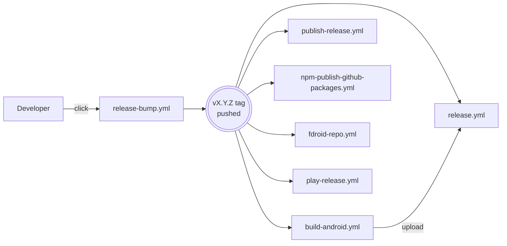

# CI Workflows

> A tour of the 29 GitHub Actions workflows that keep this repo running, grouped by purpose.
>
> *Audience: developer · Last reviewed: 2026-05-02*

Workflows live in
[`.github/workflows/`](https://github.com/smackypants/TrueAI/tree/main/.github/workflows).
Below is the inventory grouped by purpose with one-line summaries
and the events that trigger each.

---

## CI (gates on every PR / push)

| Workflow | Triggers | What it does |
| --- | --- | --- |
| `android.yml` | PR, push | Debug Android build (`build:dev` + `assemblePlayDebug`) — required check |
| `android-audit.yml` | PR, schedule | Static checks on Android Gradle config (versions, manifest, perms) |
| `codeql.yml` | PR, push, schedule | CodeQL `Analyze (javascript-typescript)` + `Analyze (java-kotlin)` — both required |
| `npm-audit.yml` | PR, schedule | `npm audit` against the GitHub Advisory DB |
| `pattern-scan.yml` | PR, push | Repo-specific pattern scans (forbidden APIs, telemetry, etc.) |
| `pr-quality.yml` | PR | Lint + typecheck + tests gate |
| `pr-automation.yml` | PR | Auto-label + assign + initial triage |

---

## Auto-fix automation (creates issues / PRs that target Copilot)

These workflows turn detected defects into issues assigned to
`@copilot` (or PRs you approve). The agent's contract for handling
these issues is in
[`.github/copilot-instructions.md`](https://github.com/smackypants/TrueAI/blob/main/.github/copilot-instructions.md)
under "Auto-fix issue contract".

| Workflow | Triggers | What it does |
| --- | --- | --- |
| `auto-bugfix.yml` | manual / schedule | Open an issue summarising a bug for Copilot to fix |
| `auto-lint-fix.yml` | schedule | Detects lint errors, opens a `[Audit]` issue with `copilot-fix` label |
| `codeql-autofix.yml` | CodeQL alerts | Opens a `[CodeQL …]` issue per new alert with `copilot-fix` label |
| `test-failure-autofix.yml` | failed test workflows | Pushes a triage issue tied to the failing PR branch |
| `apply-copilot-suggestions.yml` | PR review with suggestions | Auto-applies Copilot review suggestions on opt-in |
| `copilot-agent.yml` | issue assignment to Copilot | Bootstraps the agent's session for an auto-fix issue |
| `copilot-setup-steps.yml` | called by other workflows | Pre-installs Node 24, JDK 21, Android SDK in the agent sandbox |

---

## Release pipeline

| Workflow | Triggers | What it does |
| --- | --- | --- |
| `release-bump.yml` | manual | Bump `package.json` + Android `versionCode/Name`, prepend CHANGELOG entry, commit, tag `vX.Y.Z`, push |
| `tag-release.yml` | manual | Push a `vX.Y.Z` tag for an already-bumped version |
| `release.yml` | tag push | Create the GitHub Release shell |
| `release-full.yml` | tag push | End-to-end release orchestration |
| `build-android.yml` | tag push | Build `play` debug + release APK, `fdroid` APK, Play AAB; upload to the Release |
| `nightly-android.yml` | schedule | Nightly Android build + Maestro E2E |
| `play-release.yml` | tag push (when configured) | Upload AAB to Google Play via Fastlane |
| `fdroid-repo.yml` | tag push | Rebuild the self-hosted F-Droid repo at `smackypants.github.io/trueai-localai/fdroid/repo` |
| `publish-release.yml` | tag push | Finalise the Release (notes, assets, marking latest) |
| `npm-publish-github-packages.yml` | tag push | Publish package to GitHub Packages |

---

## Housekeeping

| Workflow | Triggers | What it does |
| --- | --- | --- |
| `auto-merge.yml` | PR ready for review | Auto-squash-merge once required checks + CODEOWNERS approval are green |
| `dependabot-auto-merge.yml` | Dependabot PR | Auto-merge Dependabot PRs that pass CI |
| `learnings-ingest.yml` | PR merge to `main` | Parses the `## Lessons learned` section of merged PR bodies and appends to `.github/copilot/LEARNINGS.md` |
| `summary.yml` | schedule / manual | Emits weekly health summary |
| `scheduled-audit.yml` | schedule | Combined dependency / config audit |

---

## Required status checks on `main`

The branch ruleset
([`.github/rulesets/`](https://github.com/smackypants/TrueAI/tree/main/.github/rulesets))
gates merges on:

- `Android CI`
- `Analyze (javascript-typescript)` (CodeQL)
- `Analyze (java-kotlin)` (CodeQL)
- The `pr-quality` lint+typecheck+tests check

Plus CODEOWNERS approval (`@smackypants`).

See [Governance & Rulesets](Governance-and-Rulesets).

---

## Modifying workflows

> ⚠️ **Editing files under `.github/**` requires explicit
> task-level approval.** Governance forbids ad-hoc workflow edits.
> If you need a workflow change, open an issue describing the
> intent and wait for approval before touching the file.

---

## See also

- [Build & Release](Build-and-Release) — what the release workflows produce
- [Governance & Rulesets](Governance-and-Rulesets) — what enforces required checks
- [Testing](Testing) — what the test workflows run
- [Contributing](Contributing) — the auto-fix issue contract
