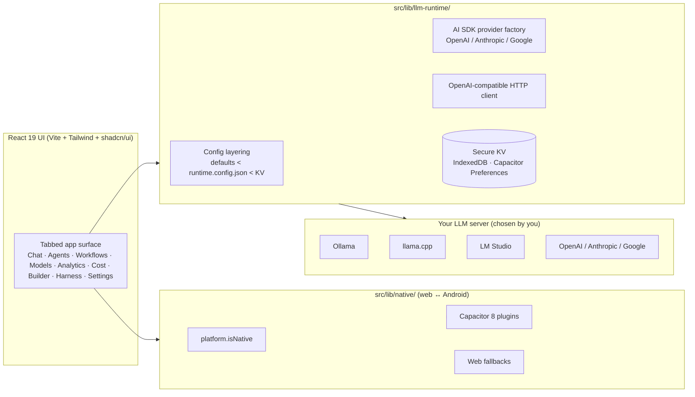

# TrueAI LocalAI

> **Local-first, private, offline-capable AI assistant platform — for the web and Android.**
>
> *Audience: both · Last reviewed: 2026-05-02*

TrueAI LocalAI is a comprehensive AI assistant that runs **on your
own hardware**. Chat, autonomous agents, visual workflows, model
management, fine-tuning helpers, analytics, cost tracking, an app
builder, and a local IDE — all wrapped in a single React app that
ships as a web app and as a Capacitor-based Android APK (with
F-Droid distribution).

There is **no telemetry**, **no analytics SDK**, **no third-party
network calls** by default. The app talks only to the LLM endpoint
*you* configure (Ollama, llama.cpp, LM Studio, OpenAI, Anthropic,
Google — your choice).

> 💛 **Support local-first AI.** [Donate via PayPal →](https://www.paypal.com/donate/?hosted_button_id=YASFVWFCH3YKS)

---

## I am a…

### 🧑‍💻 …new user
- [Installation](Installation) — web, APK, F-Droid, Play Store
- [First-Run Setup](First-Run-Setup) — pick a provider, point at your model server
- [System Requirements](System-Requirements) — what your machine / phone needs
- [End-User FAQ](FAQ-End-User) — the questions everyone asks first

### 🛠️ …a developer / contributor
- [Architecture Overview](Architecture-Overview) — the 30-second tour
- [Build & Release](Build-and-Release) — Node 24, JDK 21, Vite, Capacitor, Gradle
- [Testing](Testing) — Vitest patterns, Radix in jsdom, Android branch tests
- [Contributing](Contributing) — fork flow, what gets auto-rejected
- [Developer FAQ](FAQ-Developer) — toolchain, releases, CodeQL contract

### 🔐 …a security researcher
- [Security](Security) — private reporting channels, scope
- [Privacy](Privacy) — what stays on device, what doesn't
- [Governance & Rulesets](Governance-and-Rulesets) — branch / tag protection, allowed bots

### 🤖 …an AI agent (Copilot, automation)
- [`.github/copilot-instructions.md`](https://github.com/smackypants/TrueAI/blob/main/.github/copilot-instructions.md) — the contract
- [`.github/copilot/LEARNINGS.md`](https://github.com/smackypants/TrueAI/blob/main/.github/copilot/LEARNINGS.md) — accumulated lessons
- [Governance & Rulesets](Governance-and-Rulesets) — what your PR must not do

---

## Headline features

| Area | What it does | Page |
| --- | --- | --- |
| **Chat** | Multi-conversation chat with streaming, prompt templates, search, export | [Chat](Chat) |
| **Agents** | 14 tools, 8 templates, scheduling, ensembles, learning loop | [Agents](Agents) |
| **Workflows** | Visual node editor, 6 templates, parallel & decision nodes | [Workflows](Workflows) |
| **Models** | HuggingFace browser, GGUF library, fine-tuning, quantization, benchmarks | [Models](Models) |
| **Hardware Optimizer** | Auto-detects your device and tunes performance profiles | [Hardware Optimizer](Hardware-Optimizer) |
| **Analytics** | Real-time dashboards, learning insights, recommendations | [Analytics](Analytics) |
| **Cost Tracking** | Per-model spend, budgets, alerts, exports | [Cost Tracking](Cost-Tracking) |
| **App Builder + IDE** | Generate apps from natural language, edit code locally | [App Builder & IDE](App-Builder-and-IDE) |
| **Harness System** | Bring-your-own tools via URL or manifest | [Harness System](Harness-System) |
| **Offline + Sync** | Service worker, IndexedDB cache, queued actions, background sync | [Offline & Sync](Offline-and-Sync) |
| **Mobile (Android)** | Capacitor 8 with native plugins for storage, share, haptics, notifications | [Mobile & Android](Mobile-and-Android) |

See the full feature list in [`FEATURES.md`](https://github.com/smackypants/TrueAI/blob/main/FEATURES.md)
and the design rationale in [`PRD.md`](https://github.com/smackypants/TrueAI/blob/main/PRD.md).

---

## High-level architecture

For the full diagram set see [Architecture Overview](Architecture-Overview).

---

## Where to go next

- **Just want to use it?** → [Installation](Installation) → [First-Run Setup](First-Run-Setup)
- **Curious how it works?** → [Architecture Overview](Architecture-Overview)
- **Hit a problem?** → [Troubleshooting](Troubleshooting) or the [End-User FAQ](FAQ-End-User)
- **Want to ship a fix?** → [Contributing](Contributing) → [Build & Release](Build-and-Release) → [Testing](Testing)

---

> Read the project [Manifesto](https://github.com/smackypants/TrueAI/blob/main/README.md#-project-manifesto-local-ai-belongs-to-everyone) — the *why* behind everything here.
