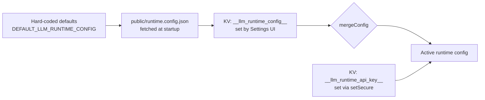

# LLM Runtime

> How `src/lib/llm-runtime/` resolves config, dispatches to providers, and persists secrets.
>
> *Audience: developer · Last reviewed: 2026-05-02*

The LLM runtime is the layer between the React UI and any
OpenAI-compatible model server. It started as a drop-in replacement
for the GitHub Spark hosted runtime, hence the `spark.*` shim files
that still live alongside the modern paths.

---

## Module map

| File | Role |
| --- | --- |
| `config.ts` | Load + merge config (defaults, runtime.config.json, KV) |
| `kv-store.ts` | Persistence — IndexedDB, Capacitor Preferences, secure path |
| `client.ts` | Direct HTTP `POST /chat/completions` fallback |
| `ai-sdk/index.ts` | Public façade for the AI SDK path |
| `ai-sdk/provider-factory.ts` | `getLanguageModel()` — dynamic provider import |
| `spark-hooks-shim.ts` | `useKV`, `spark.kv`, `spark.llm`, `spark.llmPrompt` shims |
| `use-kv.ts` | The actual `useKV` hook |
| `url.ts` | URL normalization helpers |
| `install.ts` | One-time bootstrap (called from `main.tsx`) |

---

## Config layering



Implementation: `mergeConfig(base, override)` in `config.ts`.

> ⚠️ **Security invariant**: `mergeConfig(base, null/undefined)` MUST
> return a fresh object (`{ ...base }`), never the `base` reference.
> `ensureLLMRuntimeConfigLoaded` mutates the merged result by
> assigning `merged.apiKey = apiKey`, so any reference-sharing
> optimization here would corrupt `DEFAULT_LLM_RUNTIME_CONFIG` and
> leak the user's API key to every importer. See
> `src/lib/llm-runtime/config.ts:75-104` and the regression test
> nearby.

The API key is **explicitly excluded** from the persisted
`__llm_runtime_config__` blob — it's stored separately under
`__llm_runtime_api_key__` via the secure path.

---

## Provider dispatch

`getLanguageModel(modelId?)` (in `ai-sdk/provider-factory.ts`) is the
public entry point. It:

1. Reads the active config (provider, baseUrl, defaultModel).
2. Picks the right provider module — `@ai-sdk/openai`,
   `@ai-sdk/anthropic`, `@ai-sdk/google`, or
   `@ai-sdk/openai-compatible` (covers Ollama / llama.cpp / LM
   Studio).
3. Hosted providers are **dynamically imported** so they don't bloat
   the initial bundle — local-only users never download the OpenAI
   SDK.
4. Returns an AI SDK `LanguageModel` ready for `generateText` /
   `streamText`.

The legacy `client.ts` HTTP path remains as a no-extra-deps fallback
for code that still goes through `spark.llm` / `spark.llmPrompt`
(via the shim).

---

## Secure KV invariant

`kv-store.ts` exposes both `set()` (general) and `setSecure()`
(credentials). The hard rule:

> **`setSecure()` must never fall back to `localStorage` on IDB
> failure.** All three failure paths (`tx.onerror`, `tx.onabort`, and
> `db.transaction()` throwing) must resolve silently without calling
> `lsSet`. The value stays in the in-memory cache only for that page
> lifetime. This mitigates CodeQL `js/clear-text-storage-of-sensitive-data`.

See `src/lib/llm-runtime/kv-store.ts:264-297` and the
`kv-store.test.ts → setSecure` cases that lock this down.

On Android, secure values route through `@capacitor/preferences`
instead of IDB — see [Native Layer](Native-Layer).

---

## `useKV` hydration

`useKV(key, default)`:

1. Returns `default` immediately on first render.
2. Asynchronously hydrates from KV (IDB / Preferences / cache).
3. Re-renders with the hydrated value.
4. Subscribes to KV change events so other components / windows /
   tabs writing the same key cause a re-render.

Test helper: `__resetKvStoreForTests()` clears the in-memory cache,
listeners, hydratedKeys, and persisted IDB/localStorage. Always call
it in `beforeEach` for test files that exercise `useKV` to avoid
state leaks across tests in the same file. Pair with
`await kvStore.delete(key)` for each persisted key. See
[Testing](Testing).

---

## `runtime.config.json`

Lives in `public/`. Vite copies it into `dist/` at build time, and
`cap sync` includes it in the APK. The app fetches `/runtime.config.json`
at startup; failing to fetch falls back to the hard-coded defaults.

Shape (any subset is valid; all keys optional):

```jsonc
{
  "llm": {
    "provider": "ollama",                 // or "llamacpp" | "lmstudio" | "openai" | …
    "baseUrl": "http://localhost:11434/v1",
    "defaultModel": "llama3.2"
  },
  "ui": { /* future use */ }
}
```

---

## Testing

For tests of code that uses the AI SDK, import
`mockLanguageModel` / `mockFailingLanguageModel` from
`@/test/ai-sdk-mocks`. They wrap `MockLanguageModelV3` +
`simulateReadableStream` and emit the proper text-delta stream parts
(`stream-start` / `text-start` / `text-delta` / `text-end` /
`finish`). See `src/test/ai-sdk-mocks.ts`,
`src/lib/agent/tool-loop-agent.test.ts`, and
`src/hooks/use-streaming-chat.test.ts`.

---

## See also

- [State & Persistence](State-and-Persistence) — the KV story end-to-end
- [Native Layer](Native-Layer) — secure storage on Android
- [Settings Reference](Settings-Reference) — every persisted key
- [First-Run Setup](First-Run-Setup) — user-facing view
- [Privacy](Privacy) — what data leaves the device
