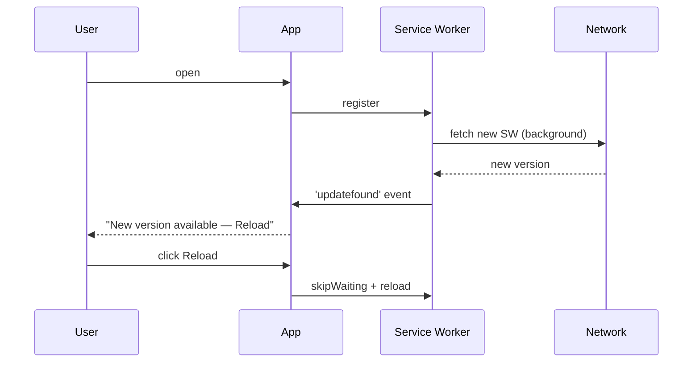

# Offline & Sync

> Service worker, IndexedDB cache, queued actions, background sync, and resume-flush behaviour.
>
> *Audience: end user (with developer notes) · Last reviewed: 2026-05-02*

TrueAI is built **offline-first**. After the first load, the app
shell, your conversations, agents, workflows, and settings all work
without a network. Outbound calls (to your model server, to hosted
APIs) get queued and replayed when you're back online.

---

## What's cached

| Layer | What it caches | Where |
| --- | --- | --- |
| **Service worker** | App shell (HTML, JS, CSS, fonts, icons) | Cache Storage |
| **IndexedDB cache** | Conversation history, large blobs | IndexedDB |
| **KV store** | Settings, agents, workflows, lists | IndexedDB (with localStorage fallback for non-secure values only) |
| **Secure KV** | API key, other credentials | IndexedDB on web, Capacitor Preferences on Android — **never** localStorage |

See [State & Persistence](State-and-Persistence) for the full
storage contract.

---

## Service Worker

`src/lib/serviceWorker.ts` registers a worker that:

- Pre-caches the app shell on first load
- Serves the shell from cache on subsequent loads (cache-first for
  static, network-first for `runtime.config.json`)
- Surfaces a toast when a **new version** is available
  (`ServiceWorkerUpdate.tsx`)
- Notifies the page on connectivity changes
  (`OfflineIndicator.tsx`)

Update flow:

See [`SERVICE_WORKER.md`](https://github.com/smackypants/TrueAI/blob/main/SERVICE_WORKER.md).

---

## Offline Queue

When you trigger an action that needs the network and you're offline
(or the request fails), the action is enqueued.
`src/lib/offline-queue.ts` and `src/lib/queued-actions.ts` handle:

- Persistence (queue survives a reload — stored in IndexedDB)
- Retry policy (up to 3 attempts with exponential backoff)
- Auto-flush when connectivity returns (listens to
  `network` events from `src/lib/native/network.ts`, plus
  `online`/`offline` browser events)
- Auto-flush when the app **resumes** (Android `appResume` from
  `src/lib/native/app-lifecycle.ts`)

UI surfaces:

- `OfflineQueueIndicator.tsx` — a small badge in the header
- `OfflineQueuePanel.tsx` — a full panel under Analytics with
  per-action retry, cancel, inspect

<!-- SCREENSHOT: offline queue panel listing pending actions -->

---

## IndexedDB cache for conversations

Conversations and other large blobs that don't fit cleanly into the
KV layer use a dedicated IndexedDB store
(`src/lib/indexeddb.ts`) wrapped by `useIndexedDBCache` hook.
The **Cache Manager** (`IndexedDBCacheManager.tsx`) shows:

- Total size used
- Per-store breakdown
- Manual purge (single store or all)

See [`INDEXEDDB_CACHE.md`](https://github.com/smackypants/TrueAI/blob/main/INDEXEDDB_CACHE.md).

---

## Install as a PWA

`InstallPrompt.tsx` listens for the browser's `beforeinstallprompt`
event and offers a one-click install. Once installed, the app gets:

- Its own window
- Standalone display (no browser chrome)
- A real launcher icon

On Android, the same UX is delivered by the Capacitor APK directly.

---

## What does *not* work offline

- New chat completions (the model server has to be reachable).
- HuggingFace browser (HF API call required).
- API tools that require a remote endpoint.

These actions either show an inline error or queue (depending on
whether the action is retry-safe).

---

## See also

- [Mobile & Android](Mobile-and-Android) — native lifecycle integration
- [State & Persistence](State-and-Persistence)
- [Performance](Performance) — service worker as a perf tool
- Canonical: [`SERVICE_WORKER.md`](https://github.com/smackypants/TrueAI/blob/main/SERVICE_WORKER.md), [`BACKGROUND_SYNC.md`](https://github.com/smackypants/TrueAI/blob/main/BACKGROUND_SYNC.md), [`INDEXEDDB_CACHE.md`](https://github.com/smackypants/TrueAI/blob/main/INDEXEDDB_CACHE.md)
