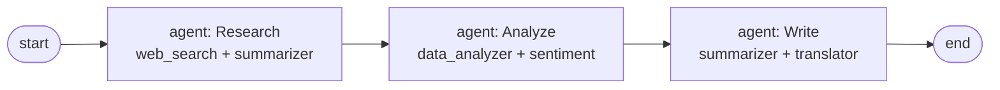
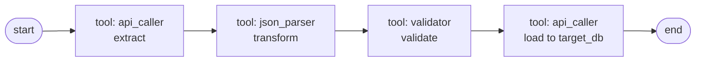
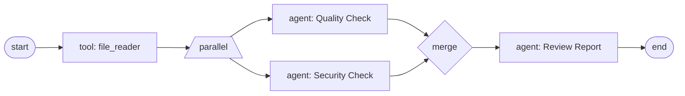
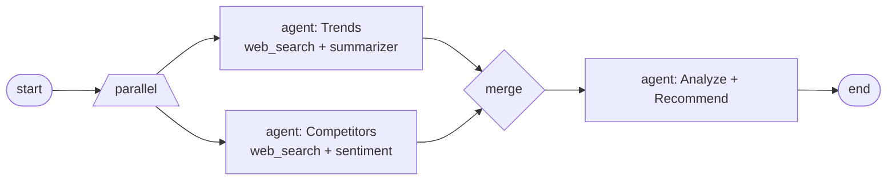
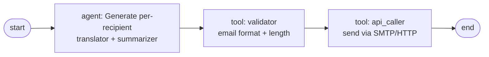
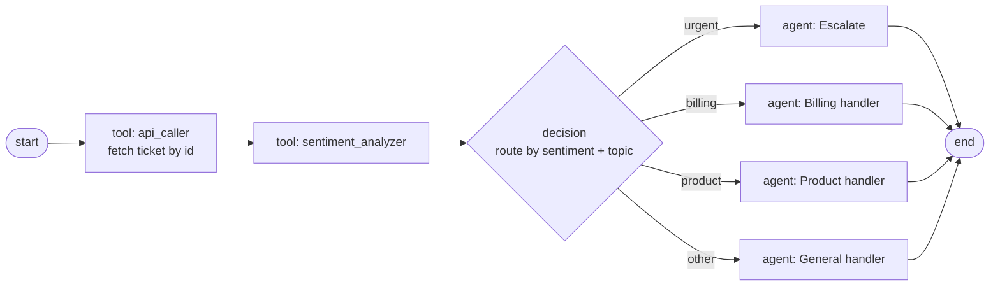

# Workflow Templates Reference

> Each of the six built-in workflow templates as a Mermaid graph plus inputs/outputs.
>
> *Audience: end user · Last reviewed: 2026-05-02*

Templates live in
[`src/components/workflow/WorkflowTemplates.tsx`](https://github.com/smackypants/TrueAI/blob/main/src/components/workflow/WorkflowTemplates.tsx).
For node-type semantics see [Workflow Engine](Workflow-Engine).

Each template is a starting point — clone it from
**Workflows → Templates → Use Template** and customise to taste.

---

## 1. Content Research & Writing

**Category:** content_creation

**Inputs**

| Name | Type | Required | Default |
| --- | --- | --- | --- |
| `topic` | string | yes | — |
| `article_length` | number | no | 1000 |

**Graph**

---

## 2. Data ETL Pipeline

**Category:** data_processing

**Inputs**

| Name | Type | Required | Default |
| --- | --- | --- | --- |
| `source_api` | string | yes | — |
| `target_db` | string | yes | — |

**Graph**

---

## 3. Code Review Automation

**Category:** development

**Inputs**

| Name | Type | Required | Default |
| --- | --- | --- | --- |
| `file_path` | string | yes | — |
| `language` | string | yes | — |

**Graph**

---

## 4. Market Research Report

**Category:** research

**Inputs**

| Name | Type | Required | Default |
| --- | --- | --- | --- |
| `market` | string | yes | — |
| `competitors` | string | no | — |

**Graph**

---

## 5. Email Campaign Automation

**Category:** communication

**Inputs**

| Name | Type | Required | Default |
| --- | --- | --- | --- |
| `recipients` | string | yes | — |
| `template` | string | yes | — |

**Graph**

---

## 6. Customer Support Triage

**Category:** business

**Inputs**

| Name | Type | Required | Default |
| --- | --- | --- | --- |
| `ticket_id` | string | yes | — |

**Graph**

---

## See also

- [Workflows](Workflows) — using and editing workflows
- [Workflow Engine](Workflow-Engine) — execution semantics
- [Tools Reference](Tools-Reference) — what each `tool` node calls
- [Agents](Agents) — what each `agent` node runs
