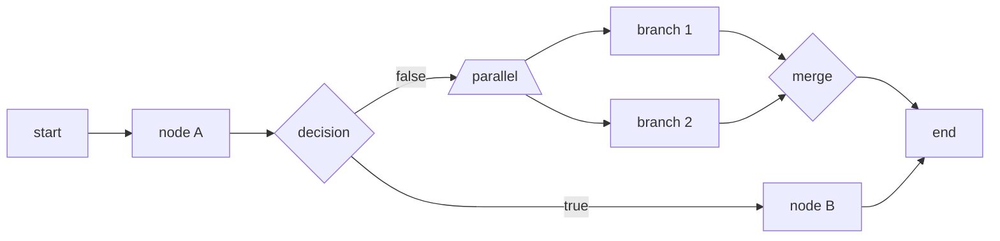

# Workflows

> Visual node-based editor for orchestrating agents, tools, decisions, and parallel branches — without writing code.
>
> *Audience: end user · Last reviewed: 2026-05-02*

A **workflow** is a directed graph of typed nodes connected by edges.
You drag nodes onto a canvas, wire them up, and run the result. The
runtime engine is in
[`src/lib/workflow-runtime.ts`](https://github.com/smackypants/TrueAI/blob/main/src/lib/workflow-runtime.ts);
the editor is `src/components/workflow/WorkflowBuilder.tsx`.

For internals see [Workflow Engine](Workflow-Engine); for the type
contract see
[`src/lib/workflow-types.ts`](https://github.com/smackypants/TrueAI/blob/main/src/lib/workflow-types.ts).

---

## Node types

| Type | Purpose |
| --- | --- |
| `start` | Entry point. Exactly one per workflow. |
| `end` | Terminator. Multiple allowed (each branch can end). |
| `agent` | Run a configured agent with the upstream output as its goal. |
| `tool` | Call a single tool directly (computation / data / etc.). |
| `decision` | Evaluate a condition; route to a branch based on the result. |
| `parallel` | Fan out to multiple downstream nodes concurrently. |
| `merge` | Fan-in: wait for all upstream parallel branches before continuing. |
| `loop` | Run a downstream sub-graph N times or until a condition. |

> Source of truth: `WorkflowNodeType` in `workflow-types.ts`.

<!-- SCREENSHOT: workflow builder canvas with several nodes wired up -->

---

## Edges

An edge is a directed connection from a source node's output to a
target node's input. Edges may carry an optional **label** and
**condition** (used by `decision` nodes to route).

The visual editor draws bezier curves between nodes; clicking an edge
opens its inspector.

---

## Building a workflow

1. **Workflows tab → New Workflow** — names the workflow.
2. The canvas appears with a **start** node already placed.
3. Drag a node type from the palette onto the canvas.
4. Click and drag from one node's output handle to the next node's
   input handle to create an edge.
5. Click any node to open its inspector and configure it (which
   agent, which tool, decision condition, parallel branches, …).
6. Place an **end** node at every terminal branch.
7. **Save** — persisted to KV under your workflows list.
8. **Run** — execution streams step-by-step into the run viewer.

---

## Built-in templates

Six battle-tested templates are shipped under
**Workflows → Templates**. Each is a fully wired graph you can clone
and customize. See
[Workflow Templates Reference](Workflow-Templates-Reference) for the
node graphs.

| Template | Category | Highlights |
| --- | --- | --- |
| Content Research & Writing | content_creation | research → analyze → write |
| Data ETL Pipeline | data_processing | extract → transform → validate → load |
| Code Review Automation | development | parallel quality + security checks → merge |
| Market Research Report | research | trends + competitors + analysis |
| Email Campaign Automation | communication | generate → validate → send |
| Customer Support Triage | business | sentiment → route by category |

> The exact templates are defined in
> [`src/components/workflow/WorkflowTemplates.tsx`](https://github.com/smackypants/TrueAI/blob/main/src/components/workflow/WorkflowTemplates.tsx).

---

## Execution semantics

Key rules (see [Workflow Engine](Workflow-Engine) for the full
spec):

- **Topological** — nodes execute when all their inputs are ready.
- **Decision** — exactly one outgoing edge fires (the one whose
  condition matches).
- **Parallel** — all outgoing edges fire concurrently.
- **Merge** — waits until *every* upstream branch completes.
- **Errors** — a failing node stops its branch and is recorded on the
  `WorkflowExecution`. Other parallel branches continue (best-effort).
- **Variables** — workflows have a shared `variables` map every node
  can read; nodes write their result to a per-node key downstream
  nodes can reference.

---

## Saving, loading, exporting

- All workflows are persisted in KV (`workflows`).
- **Export** dumps the JSON `Workflow` object — round-trippable.
- **Import** accepts that same JSON; useful for sharing.
- **Clone** copies a template into a new editable workflow.

---

## Watching a run

The execution viewer streams a `WorkflowExecution` object
(`status`, `currentNodeId`, `results`, `error`) and highlights the
currently active node on the canvas. Completed nodes are shaded
green; failed nodes red; in-flight nodes pulse.

Run history is persisted alongside the workflow.

---

## Failure handling

- A `tool` or `agent` node that throws marks itself failed; the
  workflow's status becomes `error` if no other branch can complete.
- `decision` nodes whose condition can't be evaluated route to a
  configurable **default** branch, or fail if none is set.
- Network failures inside an `api_caller` tool are retried per the
  Offline Queue rules ([Offline & Sync](Offline-and-Sync)).

---

## See also

- [Agents](Agents) — the units of work most workflows orchestrate
- [Tools Reference](Tools-Reference) — what each `tool` node can do
- [Workflow Templates Reference](Workflow-Templates-Reference) — full graphs of the six built-in templates
- [Workflow Engine](Workflow-Engine) — internals
- [Cost Tracking](Cost-Tracking) — workflows are costed end-to-end
- Canonical: [`FEATURES.md`](https://github.com/smackypants/TrueAI/blob/main/FEATURES.md), [`TOOLNEURON_COMPARISON.md`](https://github.com/smackypants/TrueAI/blob/main/TOOLNEURON_COMPARISON.md)
